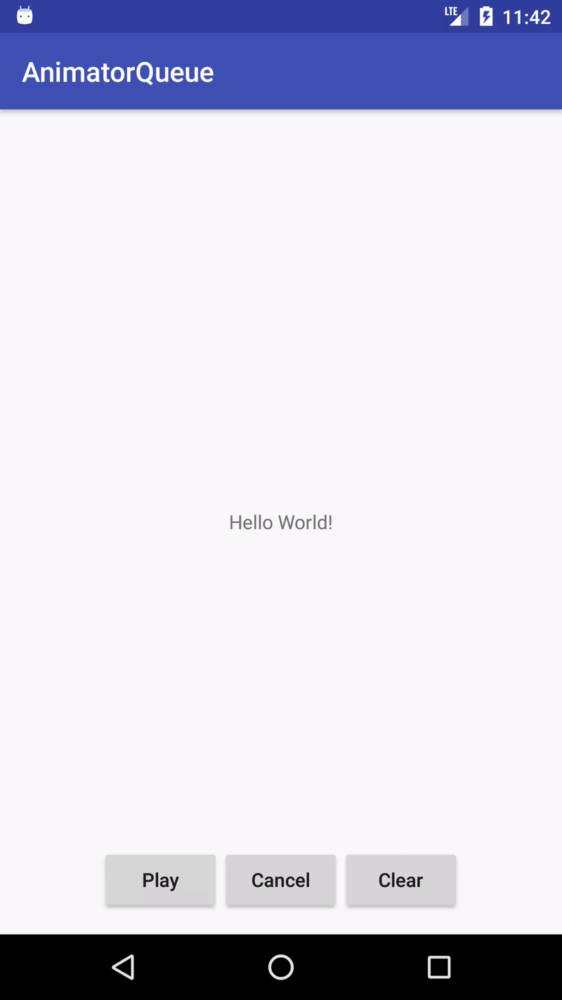

# AnimatorQueue
动画队列, 按顺序执行动画, 基于 ViewPropertyAnimator 实现, 也就是 View.animate(), 支持所有 ViewPropertyAnimator 属性

```java
    from(View view);//从给定 View 创建动画队列
    newAnimation(); // 开启一个新动画
    start();//开始执行动画
    cancel();//取消正在执行的动画
    clearAnimation();//清除动画队列 
    setDuration(long duration); // 设置动画时间
    setStartDelay(long startDelay); // 延时多少秒后执行动画
    setInterpolator(TimeInterpolator interpolator); // 设置时间插值器
    setListener(Animator.AnimatorListener listener); // 设置监听器
    setUpdateListener(ValueAnimator.AnimatorUpdateListener listener); //设置更新监听器
    // 下面懒得写了, 和 ViewPropertyAnimator 属性一样
    x(float value); //
    xBy(float value); // 
    y(float value); // 
    yBy(float value); // 
    z(float value); // 
    zBy(float value); // 
    rotation(float value); // 
    rotationBy(float value); // 
    rotationX(float value); // 
    rotationXBy(float value); // 
    rotationY(float value); // 
    rotationYBy(float value); // 
    translationX(float value); // 
    translationXBy(float value); // 
    translationY(float value); // 
    translationYBy(float value); // 
    translationZ(float value); // 
    translationZBy(float value); // 
    scaleX(float value); // 
    scaleXBy(float value); // 
    scaleY(float value); // 
    scaleYBy(float value); // 
    alpha(float value); // 
    alphaBy(float value); // 
    withLayer(); // 
    withStartAction(Runnable runnable); // 
    withEndAction(Runnable runnable); // 
```

```java
    //示例
    private ViewPropertyAnimatorQueue createAnim() {
            //创建动画队列
            ViewPropertyAnimatorQueue queue = ViewPropertyAnimatorQueue.from(textView);
            
            //判断之前有无创建动画
            //有的话可以直接使用之前的动画
            //或者 queue.clearAnimation(); 清除之前的动画
            if (queue.getAnimationSize() == 0) {
                //创建动画
                queue.newAnimation()
                        .alpha(0.5f)
                        .x(0)
                        .y(0)
                        .rotation(360)
                        .setListener(new AnimatorListenerAdapter() {
                            @Override
                            public void onAnimationEnd(Animator animation) {
                                Toast.makeText(MainActivity.this, "第一个动画结束", Toast.LENGTH_SHORT).show();
                            }
                        })
                        .setDuration(1000)
    
                        .newAnimation()
                        .rotation(360)
                        .x(540)
                        .y(270)
                        .setDuration(2000)
    
                        .newAnimation()
                        .rotationX(180)
                        .translationX(-400)
                        .translationY(50)
                        .scaleX(0.5f)
                        .setDuration(1000)
    
                        .newAnimation()
                        .scaleX(1)
                        .x(20)
                        .y(500)
                        .setStartDelay(1000)
                        .setDuration(1000)
    
                        .newAnimation()
                        .translationX(0)
                        .translationY(0)
                        .rotationX(0)
                        .alpha(1)
                        .rotation(0)
                        .setListener(new AnimatorListenerAdapter() {
                            @Override
                            public void onAnimationStart(Animator animation) {
                                Toast.makeText(MainActivity.this, "最后一个动画开始", Toast.LENGTH_SHORT).show();
                            }
                        })
                        .setDuration(2000);
            }
            return queue;
        }
```

## 效果

